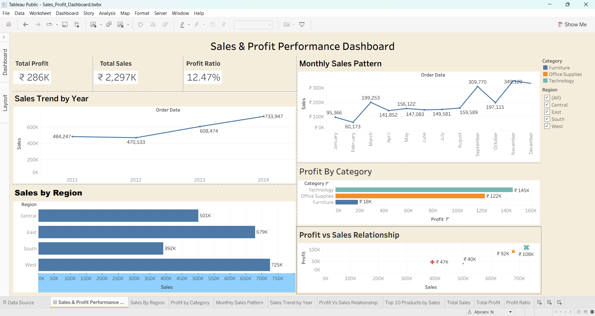

# Tableau-Sales-Profit-Dashboard

## Live Dashboard

View the interactive Tableau dashboard here:

[Sales & Profit Performance Dashboard](https://public.tableau.com/app/profile/abirami.n1460/viz/Sales_Profit_Dashboard_twbx/SalesProfitPerformanceDashboard?publish=yes)

## Project Overview

This interactive Tableau dashboard analyzes sales performance, profitability, regional trends, and top-performing products. It helps business stakeholders identify growth opportunities and make data-driven decisions.

### Dashboard Features

* Sales Trend by Year
* Monthly Sales Pattern
* Sales by Region
* Profit by Category
* Top 10 Products by Sales
* Profit vs Sales Relationship

### Tools Used

* Tableau Public
* Data Visualization
* Business Intelligence (BI)

### Key Insights

* West region generated the highest sales.
* Technology was the most profitable category.
* Sales showed overall growth from 2011 to 2014.
* Phones and Chairs were among the top-performing products.

## Dashboard Preview

### Author

Abirami N
